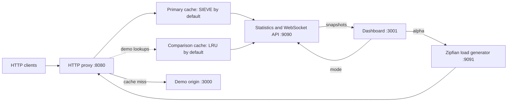

<h1 align="center">Colander</h1>
<p align="center">Explore cache eviction with a Rust HTTP proxy, a Zipfian load generator, and a live dashboard.</p>

<p align="center">
  <a href="https://github.com/kclaka/colander/actions/workflows/ci.yml"></a>
  <a href="LICENSE"></a>
  <a href="Cargo.toml"></a>
</p>

Colander implements **SIEVE**, the cache eviction algorithm introduced at
[NSDI ’24](https://www.usenix.org/conference/nsdi24/presentation/zhang-yazhuo),
alongside LRU and FIFO. Run the local demo to see how cache capacity, request
skew, and eviction policy affect hit rates.

- **Cache library:** arena-backed storage, lazy TTL expiration, and up to 64 shards.
- **HTTP demo:** a caching proxy in front of a synthetic origin with 5–20 ms latency.
- **Adjustable traffic:** control dataset size, concurrency, request rate, and Zipfian alpha.
- **Live inspection:** React charts, JSON statistics, and WebSocket snapshots.

The project is an experimental cache playground. See [current scope](#current-scope)
for the HTTP, Redis, and observability features that are still incomplete.

[Quick start](#quick-start) · [Run from source](#run-from-source) ·
[Architecture](#architecture) · [Experiments](#experiments) ·
[Configuration](#configuration) · [API](#api) ·
[Development](#development) · [Troubleshooting](#troubleshooting)

## Quick start

Install Docker with the Compose plugin, then run:

```bash
git clone https://github.com/kclaka/colander.git
cd colander
docker compose up --build -d
docker compose ps
```

Open **[localhost:3001](http://localhost:3001)** for the dashboard. Compose starts
the origin, proxy, dashboard, and a continuous load generator. The first build
compiles the Rust workspace and installs the dashboard dependencies.

| Service | Address | Purpose |
| --- | --- | --- |
| Dashboard | [localhost:3001](http://localhost:3001) | Charts and workload controls |
| HTTP proxy | [localhost:8080](http://localhost:8080) | Routes requests to the origin |
| Metrics/admin | [localhost:9090/api/stats](http://localhost:9090/api/stats) | JSON statistics and mode control |
| Demo origin | [localhost:3000/health](http://localhost:3000/health) | Health check; `/api/items/{id}` serves items |
| Load generator | [localhost:9091/status](http://localhost:9091/status) | Traffic status and control |
| Experimental RESP2 | `localhost:6379` | Redis protocol development; see [current scope](#current-scope) |

### Check a cache miss and hit

Use an item outside the load generator's default 1–100,000 range:

```bash
curl -si http://localhost:8080/api/items/100001
curl -si http://localhost:8080/api/items/100001
```

With a fresh cache, the first response includes `X-Cache: MISS` and the second
includes `X-Cache: HIT`. Header names may appear lowercase. Repeating the example
can return two hits; expiration or eviction can produce another miss.

```bash
curl -fsS http://localhost:9090/api/stats
docker compose logs --tail=50 proxy
```

Stop the demo when finished:

```bash
docker compose down
```

Cache contents are held in memory and are lost when the proxy restarts.

## Run from source

Use a current stable [Rust toolchain](https://www.rust-lang.org/tools/install).
The repository does not declare a minimum supported Rust version. For the
dashboard, use Node.js **22.12+** or a newer supported release; the locked Vite 7
dependencies also accept Node 20.19+ ([Vite requirements](https://vite.dev/guide/)).

From the cloned repository, build the binaries once:

```bash
cargo build --workspace
```

Start each service in a **separate terminal**. Run Rust commands from the
repository root so the proxy loads the checked-in `config.toml`.

**Terminal 1 — origin**

```bash
cargo run -p demo-backend
```

**Terminal 2 — proxy**

```bash
cargo run -p proxy-server
```

**Terminal 3 — dashboard**

```bash
cd dashboard
npm ci
npm run dev
```

**Terminal 4 — optional traffic generator**

```bash
cargo run -p loadgen -- \
  --proxy-url http://127.0.0.1:8080 \
  --num-items 100000 \
  --concurrency 16 \
  --rps 500 \
  --alpha 0.8
```

Open [localhost:3001](http://localhost:3001). The Vite development server forwards
metrics and control requests to ports 9090 and 9091. Without the load generator,
you can still send manual HTTP requests and inspect the cache; the alpha control
will show the generator as offline. Use Ctrl+C in each terminal to stop it.

## Architecture



The proxy serves cached responses from the primary policy. In demo mode, it also
looks up keys in a comparison cache. The synthetic origin makes cache misses
visible by adding latency. Both caches have separate storage and statistics.

### What SIEVE changes

SIEVE marks an entry as visited on a hit. During eviction, a hand scans from the
tail toward the head, clearing visited bits and removing an unvisited entry.
Visited entries stay in place rather than moving to the front of the list.

| Policy | On a live hit | When full |
| --- | --- | --- |
| SIEVE | Mark the visited bit | Scan for an unvisited entry |
| LRU | Move the entry to the head | Evict the least recently used entry |
| FIFO | Leave insertion order unchanged | Evict the oldest entry |

In **this implementation**, every policy lookup takes a shard write lock to
update statistics and remove expired entries. SIEVE avoids list promotion, but
Colander's hit path is not lock-free. The original paper's performance results
are research context, not benchmark results for this repository.

[`colander-cache`](crates/colander-cache/) stores list nodes in an arena using
`u32` indices and a reusable free list. Shards share a process-random hash mapping
across policies. Capacity is distributed exactly across up to 64 shards, with
fewer shards for small caches. Eviction is local to each shard, so uneven key
distribution can cause eviction before every slot in the overall cache is full.

Expired entries are removed on lookup; SIEVE can also remove them during its
eviction scan. There is no background expiration sweep.

## Experiments

### Change the workload

Higher alpha concentrates requests on fewer items. The load-generator API accepts
values from `0.01` to `3.0`; the dashboard slider exposes a narrower range.

```bash
# Change skew while traffic is running.
curl -fsS http://localhost:9091/control \
  -H 'Content-Type: application/json' \
  -d '{"alpha":1.2}'

# Pause traffic to inspect the cache.
curl -fsS http://localhost:9091/control \
  -H 'Content-Type: application/json' \
  -d '{"running":false}'

# Resume traffic.
curl -fsS http://localhost:9091/control \
  -H 'Content-Type: application/json' \
  -d '{"running":true}'
```

`--rps` limits the aggregate request rate across all workers; `0` means unlimited.
Compose uses unlimited traffic by default. Dataset size and concurrency must be
positive. Use `cargo run -p loadgen -- --help` for all startup options.

### Switch modes

| Mode | Primary cache | Comparison cache |
| --- | --- | --- |
| `demo` (initial mode) | Serves requests | Participates in cache lookups and insertions |
| `bench` | Serves requests | Skipped by the HTTP lookup/insertion path |

```bash
curl -fsS http://localhost:9090/api/mode \
  -H 'Content-Type: application/json' \
  -d '{"mode":"bench"}'
```

Use `{"mode":"demo"}` to switch back. Switching mode does not reset cache contents
or counters. To compare separate runs, restart the proxy and record the policy,
capacity, TTL, dataset size, alpha, concurrency, and RPS limit for each run.

Hit rates are cumulative since cache creation. Dashboard throughput is derived
from primary cache lookups, rather than counting every HTTP request. A higher
alpha does not guarantee that SIEVE wins. The [comparison limitations](#current-scope)
also matter when interpreting the charts.

## Configuration

The proxy reads `config.toml` from its **working directory**. Use the checked-in
[local configuration](config.toml) as a starting point. Compose mounts
[`docker/config.toml`](docker/config.toml), where the upstream hostname is `backend`.

If no file exists, the proxy uses built-in defaults. A supplied file must include
`[upstream]` and its `url`; parse/read failures currently fall back to defaults
and are logged. These defaults are not identical to the checked-in file: for
example, the file binds RESP to loopback, while built-in defaults bind it to all
interfaces.

| Setting | Checked-in local value | Meaning |
| --- | --- | --- |
| `server.listen_addr` | `0.0.0.0:8080` | HTTP listener |
| `server.metrics_addr` | `0.0.0.0:9090` | Statistics, WebSocket, and admin listener |
| `upstream.url` | `http://127.0.0.1:3000` | Origin; the current client uses HTTP |
| `upstream.timeout_ms` | `5000` | Declared setting; currently not enforced |
| `cache.capacity` | `10000` | Entry limit **per policy**, distributed across shards |
| `cache.default_ttl_seconds` | `60` | Lifetime when a response supplies no parsed max-age |
| `cache.max_body_size_bytes` | `1048576` | Largest body admitted to the HTTP cache (1 MiB) |
| `cache.eviction_policy` | `"sieve"` | `"sieve"`, `"lru"`, or `"fifo"` |
| `cache.comparison_policy` | `"lru"` | Omit this key inside `[cache]` to disable comparison |
| `resp.enabled` | `true` | Start the experimental RESP listener |
| `resp.listen_addr` | `127.0.0.1:6379` | Local RESP bind address |

In demo mode, each policy has its own entry capacity; `capacity` is not a byte
budget. The body-size limit controls cache admission, not upstream response
buffering. Set `resp.enabled = false` if you only need the HTTP demo.

### Reloading configuration

The watcher attempts to apply TTL and policy changes at runtime. A default-TTL
change affects newly inserted entries, not existing entries. A policy change
rebuilds the caches and clears their data and counters.

For predictable behavior, restart after changing capacity, body limits, listener
addresses, or upstream settings. The current watcher does not reliably handle
atomic file replacement, and ignored settings can interact with later policy
reloads. Check startup/reload logs to confirm the configuration being used.

The demo/admin listeners have no authentication, and Compose publishes their
ports on the host. Run the demo on a trusted local machine; the current HTTP
cache does not isolate authenticated or personalized traffic.

## API

| Service | Method and path | Result |
| --- | --- | --- |
| Proxy `:8080` | Any method, any path | Forwards to the configured origin; eligible GET responses can be cached |
| Metrics `:9090` | `GET /api/stats` | Primary/comparison cache statistics and mode |
| Metrics `:9090` | `POST /api/mode` | Set `"demo"` or `"bench"`; invalid modes return 400 |
| Metrics `:9090` | `GET /ws/metrics` | WebSocket snapshots approximately every 500 ms |
| Metrics `:9090` | `GET /metrics` | Prometheus recorder output; cache instruments are not registered yet |
| Loadgen `:9091` | `GET /status` | Alpha, running state, completed requests, and startup parameters |
| Loadgen `:9091` | `POST /control` | Update `alpha` and/or `running` |
| Origin `:3000` | `GET /health` | `ok` |
| Origin `:3000` | `GET /api/items/{id}` | Synthetic JSON item for an unsigned integer ID |

Normal cache-hit and upstream responses include these diagnostic headers.
Locally generated upstream-error responses do not necessarily include them.

| Header | Values |
| --- | --- |
| `X-Cache` | `HIT`, `MISS` |
| `X-Cache-Policy` | `SIEVE`, `LRU`, `FIFO` |
| `X-Mode` | `demo`, `bench` |

For response fields, see [`PolicyMetrics` and `MetricsSnapshot`](crates/proxy-server/src/metrics.rs).
A `hit_rate` is a fraction from 0 to 1; the dashboard displays a percentage.

## Current scope

The HTTP demo, cache policies, load controls, and JSON/WebSocket statistics are
implemented. The following boundaries describe the code on this branch:

| Area | Current limitation |
| --- | --- |
| HTTP forwarding and caching | Request headers are not forwarded. Credential/cookie bypass, `Vary`, conditional requests, and complete shared-cache freshness handling are not implemented. Responses are fully buffered before cache admission. |
| Policy comparison | A primary hit does not fill a shadow miss; a primary miss can replace a shadow hit. Treat dashboard comparisons as exploratory, not an unbiased policy benchmark. |
| RESP2 | The command dispatcher handles a small Redis-like subset, but the current reply encoder can fail to send replies. Keys share the HTTP namespace; binary-key handling, command validation, and expiration semantics are incomplete. This is not a Redis replacement. |
| Prometheus | The recorder and endpoint exist, but application cache metrics and latency histograms are not wired up. Use `/api/stats` or `/ws/metrics` for current statistics. |
| Lifecycle | Shutdown signals are handled, but full draining of active requests is not guaranteed. Configuration reloads have the limitations described above. |
| Benchmarks | The Criterion target is a placeholder; it currently contains no measurements. |

The HTTP admission path currently accepts GET/200 responses within the body-size
limit and rejects basic `no-store`, `no-cache`, and `private` directives. It is not
a complete [RFC 9111](https://www.rfc-editor.org/rfc/rfc9111) cache implementation.

## Development

Run these from the repository root:

```bash
cargo build --workspace
cargo test --workspace
cargo test -p colander-cache
cargo fmt --all -- --check
cargo clippy --workspace -- -D warnings -A dead_code
```

The formatting, Clippy, and workspace-test commands match the current
[GitHub Actions workflow](.github/workflows/ci.yml). Test counts are intentionally
not pinned in this README.

For the dashboard:

```bash
cd dashboard
npm ci
npm run lint
npm run build
```

The current dashboard package has no test script, and its checks are not yet part
of the Rust CI job. [`cache_bench.rs`](crates/colander-cache/benches/cache_bench.rs)
is an empty Criterion harness; adding workloads there is needed before reporting
repository benchmark numbers.

### Project map

| Path | Start here for |
| --- | --- |
| [`crates/colander-cache/`](crates/colander-cache/) | Policies, arenas, sharding, and cache tests |
| [`crates/proxy-server/`](crates/proxy-server/) | HTTP forwarding, configuration, protocols, and statistics |
| [`crates/loadgen/`](crates/loadgen/) | Workload generation, pacing, and control API |
| [`crates/demo-backend/`](crates/demo-backend/) | Synthetic origin and health endpoint |
| [`dashboard/`](dashboard/) | React components, charts, and Vite proxy configuration |
| [`docker/`](docker/) | Container builds and Docker-specific configuration |
| [`docker-compose.yml`](docker-compose.yml) | Service wiring, published ports, and health checks |

## Troubleshooting

| Symptom | Check |
| --- | --- |
| Docker services are not ready | Run `docker compose ps` and `docker compose logs --tail=100`. The first Rust build can take time. |
| Address already in use | Stop the conflicting local service. For Compose, adjust host port mappings; changing container listen addresses also requires updating service routing. |
| Proxy returns 502 | Check the origin's `/health`, `upstream.url`, and proxy logs. Local runs use `127.0.0.1`; Compose uses `backend`. |
| Dashboard is disconnected | Check `/api/stats` on port 9090. Open the dashboard through its Vite or nginx server, rather than opening `index.html` directly. |
| Alpha slider says offline | Start `loadgen` and check `/status` on port 9091. |
| Two cache checks both hit | Use a fresh item ID or restart the proxy; the entry may already be cached. |
| Node engine or install errors | Check `node --version` against the requirements above, then run `npm ci` in `dashboard/`. |
| Redis hangs or Prometheus has no cache series | These are current implementation limitations; see [current scope](#current-scope). |

## References

- [SIEVE: NSDI ’24 paper, talk, and slides](https://www.usenix.org/conference/nsdi24/presentation/zhang-yazhuo)
- [SIEVE project and trace results](https://cachemon.github.io/SIEVE-website/)
- [HTTP caching specification, RFC 9111](https://www.rfc-editor.org/rfc/rfc9111)
- [Redis serialization protocol](https://redis.io/docs/latest/develop/reference/protocol-spec/)

## License

[MIT](LICENSE) · Copyright 2026 KennyIgbechi
